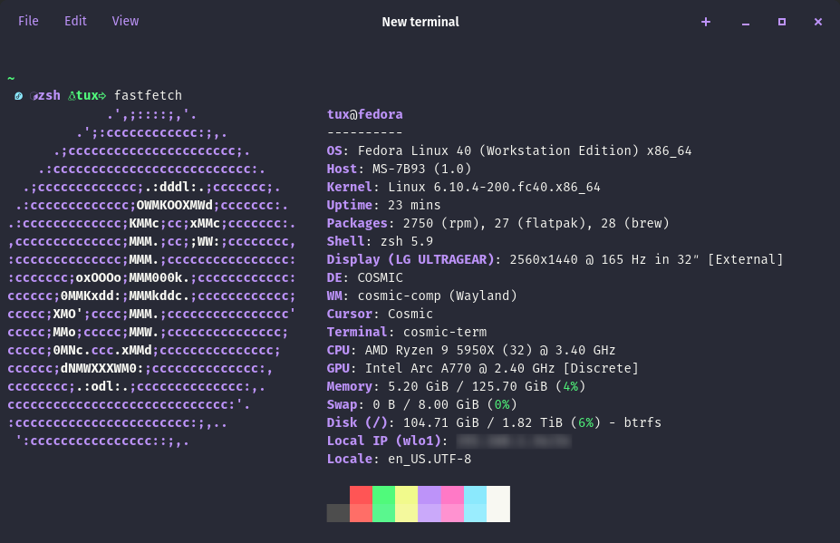

# Dracula for [Cosmic Terminal](https://github.com/pop-os/cosmic-term)

> A dark theme for [Cosmic Terminal](https://github.com/pop-os/cosmic-term).

## Install

### 1. Clone Repo:

    git clone https://github.com/eosdev-x/Dracula_for_Cosmic.git

### 2. Locate "View":

- In the top left corner of your screen, find the menu item labeled "View".

### 3. Access Color Schemes:

- Click on "View", and from the dropdown menu, select "Color schemes".

### 4. Import the File:

- In the color schemes window, look for an "Import" button and click it.
  Find the "Dracula_for_Cosmic.ron" file you downloaded earlier and select it to import the color scheme.
    
## All instructions can be found at [draculatheme.com/foobar](https://draculatheme.com/foobar).

## Team

This theme is maintained by the following person(s) and a bunch of [awesome contributors](https://github.com/dracula/foobar/graphs/contributors).

|  |
| ---------------------------------------------------------------------------------------- |
| [eosdev](https://github.com/eosdev-x)                                               |                                             |

## Community

- [Twitter](https://twitter.com/draculatheme) - Best for getting updates about themes and new stuff.
- [GitHub](https://github.com/dracula/dracula-theme/discussions) - Best for asking questions and discussing issues.
- [Discord](https://draculatheme.com/discord-invite) - Best for hanging out with the community.

## Dracula PRO

## License

[MIT License](./LICENSE)
